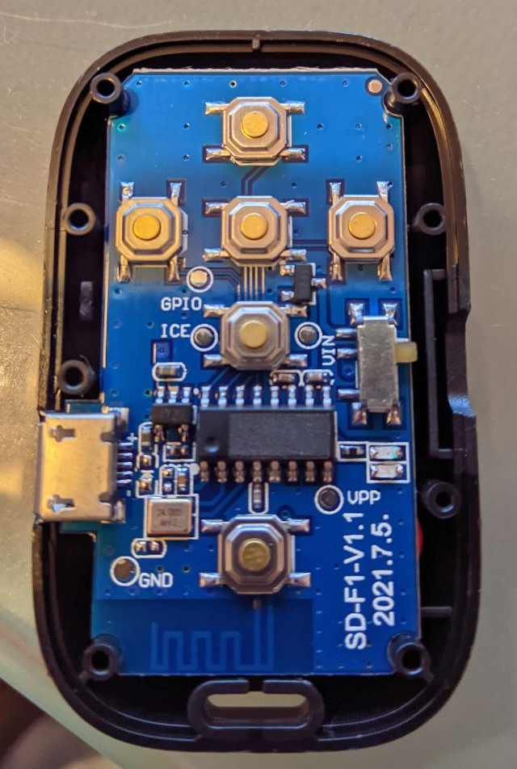
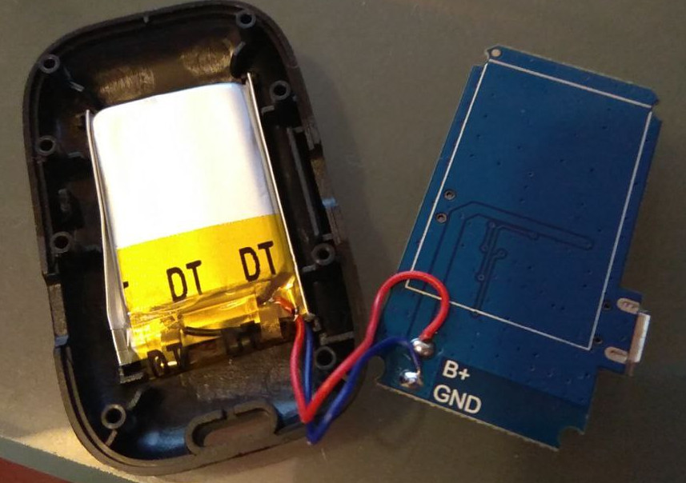

# bluetooth-tiktok-remote
I bough one of the many bluetooth remotes sold on aliexpress as tiktok remote, thinking it would emulate a keyboard.

Once I received it, I found that it emulates mouse movements instead, so I'd like to reprogram it.

I opened it but I found that the chip identification had been filed down.

on the back there is no useful identification either

The device identifies itself as "Beauty-R1" and the seller says the chip is from Yizhao.

I couldn't find anything searching for the manufacturer, the bluetooth id  or the markings on the pcb.

